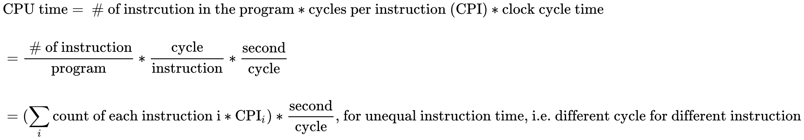
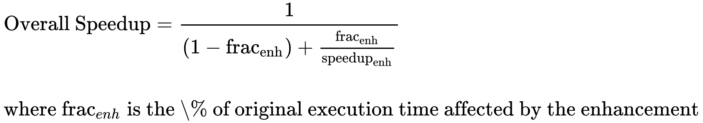
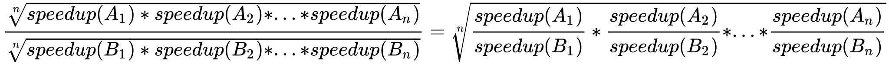

# Performance Evalutation

## Common metric for performance of computer system

### Latency

- Measure the how much time takes from the task started until it is done 

### Throughput

- Measure how many tasks can be done in unit time

## Iron Law of performance of a processor

<!-- $$
\begin{aligned}
 & \text{CPU time} = \text{ # of instrcution in the program} * \text{cycles per instruction (CPI)} * \text{clock cycle time} \\ 

 \\
 & = \frac{\text{ # of instruction}}{\text{program}} * \frac{\text{cycle}}{\text{instruction}} * \frac{\text{second}}{\text{cycle}}\\

 \\
 &=(\sum_i{\text{count of each instruction i} * \text{CPI}_i}) * \frac{\text{second}}{\text{cycle}} \text{, for unequal instruction time, i.e. different cycle for different instruction}
\end{aligned}
$$ --> 

 

- \# of instruction in the program, related to
  
  - Algorithm
  
  - Complier
  
  - Instruction set design

- cycle per instruction, related to
  
  - Instruction set design
  
  - Processor design

- clock cycle time, related to

  - Processor design
  
  - Circuit design
  
  - Transistor physics  

### The focus of computer architecture

#### Instruction Set Improvement

- complex instruction: fewer instructions but more cycle needed for one instruction

- simple instruction: more instructions but fewer cycle needed for one instruction 

#### Processor Design Improvement

- shorter time for one cycle: more cycle needed for one instruction

- longer time for one cycle: less cycle needed for one instruction

### What if only the speedup only apply on part of the program or instructions?

#### Amdahl's Law

<!-- $$
\begin{aligned}

& \text{Overall Speedup} = \frac{1}{(1 - \text{frac}_\text{enh}) + \frac{\text{frac}_\text{enh}}{\text{speedup}_\text{enh}}} \\
 
\\

&\text{where frac}_{enh}\text{ is the \% of original execution time affected by the enhancement} \\

\end{aligned}
$$ --> 

- Implication
  
  - You will not get very large improvement if you put effort on speeding up the small part of execution time
  
  - **Make the common case fast !!!!**
  
  - **Don't make the uncommon case too slow!!!**
   
  - **Law of Diminishing Return - We cannot get improvement if we only focus on the same portion of execution time**
## Performance comparsion

- We usually say "X is Y times faster than Z", then Y is the speed up

-  Y = speed(X) / speed(Z), similiar logic can be applied to throughput measurement, but not latency

- As latency is not directly propotional to performance, but inversely propotional, larger the latency, slower the speed => Y = latency(Z) / latency(X)

### Interpretation of performance

- speedup > 1 => performance improved

- speed <= 1 => performance unchanged or even worse than before 

### Summarizing the performance

- simple average cannot be directly to speedup (taking average of all speedup ratio of each application). 
  
- The correct way is to directly apply geometric mean of the speedup, the result will be the same as finding the geometric mean of the metric and calculate the speedup because of the following:

<!-- $$
\frac{\sqrt[n]{speedup(A_1) * speedup(A_2) * ... * speedup(A_n)}}{\sqrt[n]{speedup(B_1) * speedup(B_2) * ... * speedup(B_n)}} = \sqrt[n]{\frac{speedup(A_1)}{speedup(B_1)} * \frac{speedup(A_2)}{speedup(B_2)} * ... * \frac{speedup(A_n)}{speedup(B_n)} }
$$ --> 

