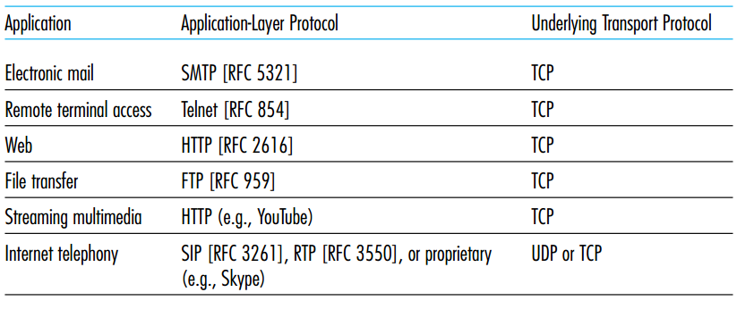

# Application Layer

## Application architectures
### Client-Server Model
* Server
  
  * Permanent IP address
  
  * Data centers for scaling

* Client
  
  * May have dynamic IP address
  
  * Do not communicate directly with each other
### Peer-to-peer Model
* No always relie on dedicated server

* Self-scalability -> when new peer come in, we will get the resources of that peer, but also add the load to the system

* cost effective -> not require server infrastructure 
## Process communication
* Client process is the process initiate the process, server process is the process waits to be contacted. They communicate to each other by socket

* The process use IP address and port number to address each other

## Transport Services avilable to application
The services provided by transport-layer protocol to the application layer

* Reliable data transfer
* Throughput
* Timing
* Security

Common Applications with corresponding transport protocol

 

## Common application layer protocol
### HTTP (Hypertext Transfer Protocol)
* client-server model (HTTP request and response)

* use port 80

* Stateless -> no memory of past request

* use TCP

* HTTP methods
  * GET
  * POST
  * PUT
  * DELETE
  * HEAD
* Common HTTP response status codes
  * 2xx (request success)
    * 200 -> OK
  * 3xx (redirect)
    * 301 -> Moved Permanently
  * 4xx (client error)
    * 400 -> Bad request
    * 404 -> Not found
  * 5xx (server error)
    * 505 HTTP version not supported
  
#### Non-persistent and persistent HTTP
* Non-persistent
  * Send at most one object sent over TCP

  * multiple objects transmission required multiple connections
  
  * response time = 2RTT + file transmission time

* Persistent
  
  * Multiple objects can be sent over in single TCP connection

  * 1 RTT for 1 object

#### Web caching (Proxy server)
network entity that satisfies HTTP requests on the behalf of an origin Web server

* It can reduce the response time for a client request
* But introduce the problem that the data maybe outdated in cache compare to the verion on server
##### The events for requesting the server with web caching:
1. The client established the connection to the web cache
2. If the web cache contains the data requested by the client, it will return it to the client (hit)
3. Otherwise, the cache established the connection to the orignal server
4. After the cache the get the requested data from the orginal server, it will copy it into its local storage, and send it back to the client
 
#### HTTP Conditional GET (soltuion to outdated data in cache)
A mechanism that allows a cache to verify that its objects are up to date
* When the cache create the local copy of the object, it add the "last modified date" into the record
  
* Whenever the requested object is in cache, the cache send the conditional GET request to server to check whether there is a updated version

* The server will only send the response message but not the object if the object hasn't been modified

#### Cookies
It is a client side object used for store the state of the user. As HTTP request is stateless, it is useful to use this object to keep user information. (improve user expreience)
* Usage
  * authorization
  * shopping carts
  * recommendations
  * user session state
### Mail Services(SMAP, POP3)
## Content Distribution Networks(CDN)
It manages servers, which stores multimedia content, in multiple geographically distributed locations, and attempts to direct each user request to a CDN location that will provide the best user experience