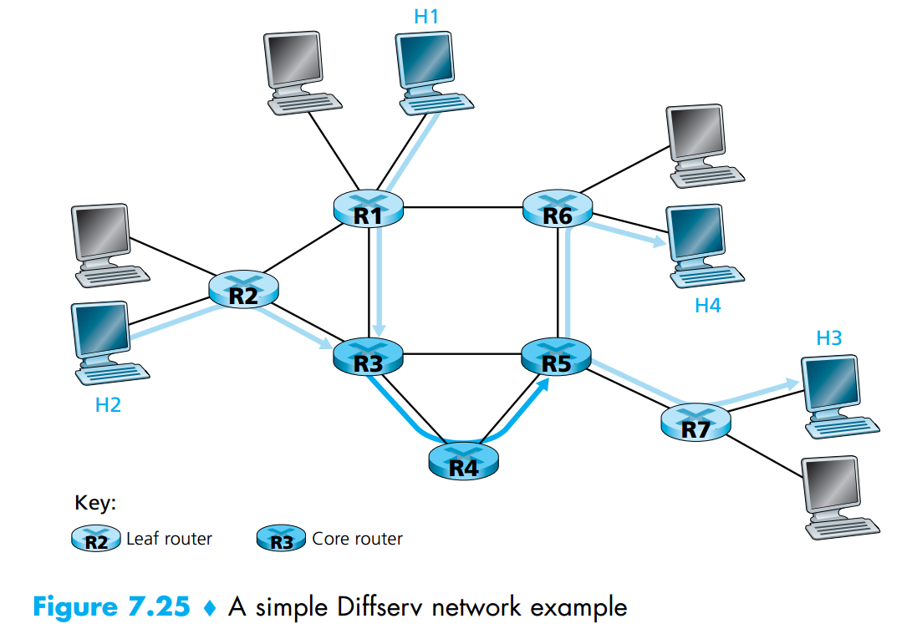
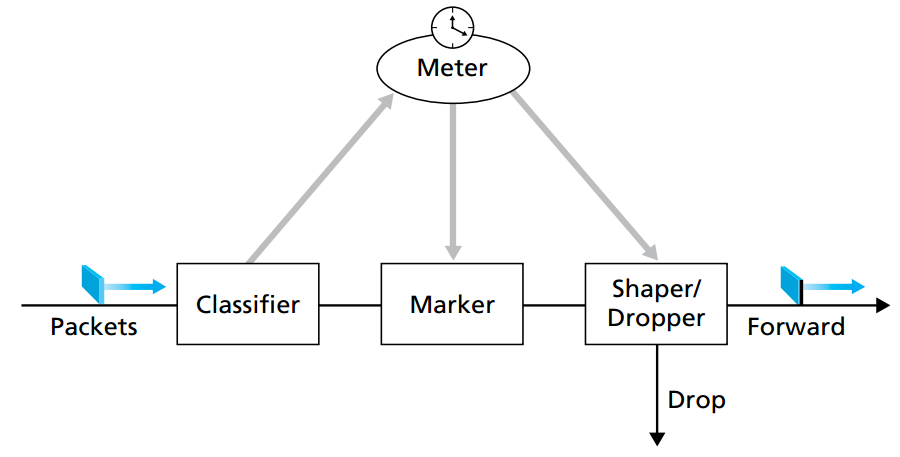
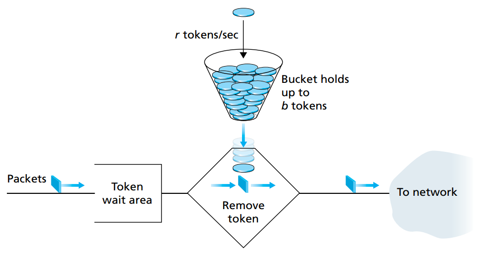

# Multimedia Networking
## QoS of Multimedia Networking

### Diffserv

 

The structure consists of two main functions:
#### Edge functions
* Edge router responsible for packet classification and traffic conditioning
  
* The mark that a packet receives identifies the class of traffic to which it belongs. 
  
* Different classes of traffic will then receive different service within the core network

* Meter a class (statistics and measurement)
   
* Remark out-of-profile packets for the class 

* Per-flow traffic management
  
* Delay and/or drop out-of-profile packets toward the core

#### Core functions  
* Core router responsible for forwarding

* Queue and/or drop packets

* The packet is forwarded onto its next hop according to the per-hop behavior (PHB) corresponding to its class

* Per-class traffic management

#### per-hop behavior (PHB)  
* PHB determines how a router’s buffers and link bandwidth are shared among the competing classes of traffic

* The expedited forwarding (highest priority, require very low delay/jitter with assured bandwidth)
  * Specifies that the departure rate of a class of traffic from a router must equal or exceed a configured rate. 

* The assured forwarding (different priority for different class, IEEE standard: Premium, Gold, Silver, Bronze)
  * Divides traffic into four classes, where each AF class is guaranteed to be provided with some minimum amount of bandwidth and buffering.

#### General structure of diffserv

 

##### Explanations
* For each packets, there is a traffic profile which contains a limit on the peak rate, as well as the burstiness of the packet flow

* After that, whenever there is a incoming packet, the meter compare the packet to the traffic profile to determine whether the packet is in-profile or out-of-file (marked by marker)

* The actual decision about the packet, including drop, remark, forward, delay, is determined by the policy of the system

### Policing
The main criteria are:
* Long term average rate

* Peak rate
  * Maximum number of packets can be sent in a **short period** of time (maybe in term of minute)

* Maximum Burst size

  * Maximum number of packets can be sent into the network over an **extremely short interval** of time (interval legth -> 0)
  
#### Leak Bucket 

 

##### General idea
* Given a leaky bucket which can hold up to b tokens, the tokens are always being generated at a rate of r/s

* If the bucket is not full, the token will be added into to the bucket

* Otherwise, the newly generated token will be ignored.
##### Application
* For each incoming packet, it will remove a token from the bucket

* If the bucket is empty, the packet must wait for the newly token

* The maximum burst size = b packets because of at most b tokens in the bucket

* The maximum number of packets can be entered to the network at any inerval t = r * t + bs