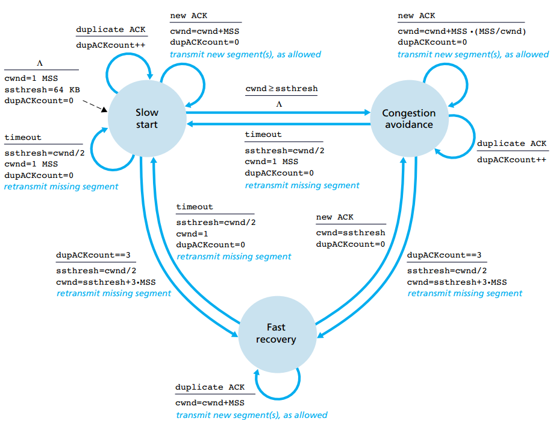

# Transport Layer
## UDP (User Datagram Protocol)
### Characteristic
#### Segment Structure
* only four fields in the header, two bytes for each

 

#### Connectionless
  
  * Use destination port number to deliever the segment to corresponding application process
  
  * No handshaking before sending a segment

### Why choose UDP over TCP
*   Finer application control
   
       * The congestion control mechanism of TCP may lead to the low transmission rate of the network if multiple links is congested.
  
       * The reliable data transfer serivce may cause the long time delivery of the packet if the segments have not been ACKed in a long time such that TCP keep re-sending the same data to the client   
  
       * What UDP will only do is that pass the segment to the network layer immediately   
   
       * For real time application, it is required a minimum sending rate and without overly delay the segment transmission.  Also it can tolerate some data loss. So UDP maybe better
  
*   No delay introduce as there is no connection establishment

*   No connection state that reduce the workload of server
  
       * TCP need to maintain different connection state includes the receive and send buffers, congestion control parameter and so on.
  
       * UDP doesn't maintain any connection states that the server can support more active clients when the application runs over UDP rather than TCP

* Small packet header overhead
  
## TCP (Transmission Control Protocol)
### Characteristic
#### Segment structure
* The header size is typically 20 Bytes 

 

#### Connection-oriented
* Handshaking before connection

* Maintain state variable for congestion control and flow control
  
* Re-transmission mechanism (timeout -> retransmit)
#### Others
* Full dulpex service: data can flow from A->B or B->A at the same time 
*  Point to Point: multicasting is not allowed and there must be single sender and receiver

### Three way handshake for initiate the connection
The process for TCP to initiate the connection

 

#### Explanations
1. The client send the segment: SYN **bit** = 1, seq = client_isn (randomly generated) to server, to server, to establish the connection (client: SYN_SEND, Server: LISTEN)
   
2. The server send the segment: SYN **bit** = 1, seq = server_isn (randomly generated), ack = client_isn + 1 to client, to acknowledge the segements sent from the server (Client:SYN_SEND, Server: SYN_RCVD)
   
3. The client send the segment: SYN **bit** = 0, seq = client_isn + 1, ack = server_isn + 1, to acknowledge the acknowledgment from server. (ESTABLISHED for both)

*Remarks: 
* ACK = next byte of the received data (received seq + 1)
* After the connections is established, the seq = last seq + X, where X is the number of byte/ window size

##### Why three ways handshake but not two?
* The first handshake is actaully to let the server know the client is able to send the packet, if the server can receive the packet, that means the client can send to packet 
   
* The second handshake is to let the client know the server is able to send the packet, also indicating that the server can successfully receive the packet
  
*  The third handshake is to let the server know the client can successfully receive the packet from server.

In order to let the server and client to ensure that they can both send and receive packet, the **three** ways handshake is required.

### Four ways handshake for terminate the connection
The process for TCP to terminate the connection

 

#### Explanations
1. The client send the segment with FIN = 1, to indicate the client has no data to send. But it can still recieve the data from the server
   
2. The server send the data segment with ACK = 1, to acknowledge the FIN flag of client, and start transmit the rest of the data
   
3. After the server finished the data transmission, the server send the segment with FIN = 1, to indicate the server has no data to send

4. The client send the segment with ACK = 1, to acknowledge the FIN flag from server, and close the connection 

### Performance Evaluation 

#### Round trip time (RTT)

##### Estimation
* SampleRTT
  
  * The time for a segment is the amount of time between the segment is sent and when the ACK of that segments is recieved
  
  * As the values will fluctuate from segment to segment due to the congestion of the router or the load of the link in the network
  
  * To estimate the typical RTT, it is natural to take some sort of average (Exponential average) of the sampling values, which given by the following equation  

$$
       \text{EstimatedRTT} = (1 - \alpha) * \text{EstimatedRTT} + \alpha * \text{SampleRTT} \\

       \text{The typical } \alpha {= 0.125}
$$

* DevRTT
  
  * It is measure of the variability of the RTT
  
  * It is an estimate of how much SampleRTT typically deviates from EstimatedRTT
  
  * It is also a exponential average

$$
       \text{DevRTT} = (1 - \beta) * \text{DevRTT} + \beta * \text{|SampleRTT - EstimatedRTT|} \\

       \text{The typical } \beta {= 0.25}
$$
#### Timeout 
* The design of the timeout should be >= EstimatedRTT, otherwise, unnecessary packet will be re-transmittd. 

* But it cannot be too large, otherwise the segment transmission will suffer from a large transmission delay

* The general idea is the EstimatedRTT + some margin, the formula is given by the following:

  * If there is high fluctuation of the RTT, then the margin should be larger, otherwise it should be smaller (adaptive approach based on the DEVRTT). 

$$
       \text{TimeoutInterval} = \text{EstimatedRTT} + 4 * \text{DevRTT}
$$

* In TCP standard, the timeout interval initially start at 1, then double itself when collision occur (1, 2, 4, ... , 2^x) in order to avoid the premature timeout of the subsequent packet

#### Congestion Control
##### General guidling principles of TCP congestion control
*  A lost segment implies congestion, decrease the sending rate when the segment is lost

* ACK received implies the network can deliver the sender segments to receiver, increase the sending rate when ACK is received.

* Bandwidth probing
  * Keep increase the sending rate until the segment is lost
  
  * if the segment is lost, the sender back off a bit for some time, and repeat the process

##### State diagram of TCP congestion control
 
 

##### Explanation
* Slow Start
  * At the begining, set the congestion window size(cwnd) = 1 MSS, sending rate = MSS/RTT (Maximum segement size) / (round trip time)

  * Increase cwnd 1 MSS every time when the tranmitted segment is first acknowledge, and doubling the cnwd every RTT
  
  * If the segment is timeout -> congestion avoidance

    *  Set ssthresh = cwnd/2(slow start thresold, used for to limit the grow of the cwnd), cwnd = 1
  
  * If received three duplicated ACKs -> re-transmission

* Congestion avoidance
	* TCP become more conservatives -> increase the cwnd by 1 MSS every RTT
    	* It can be accomplished by set cwnd =cwnd + MSS * (MSS/cwnd)

	* If received three duplicated ACKs -> re-transmission
	
	*
* Fast recovery
  * Increase cwnd 1 MSS for every duplicated ACKs

  * If timeout -> slow start
  
  * If the ACK for the missing segment is received -> congestion avoidance