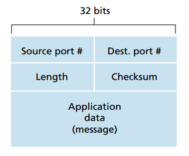
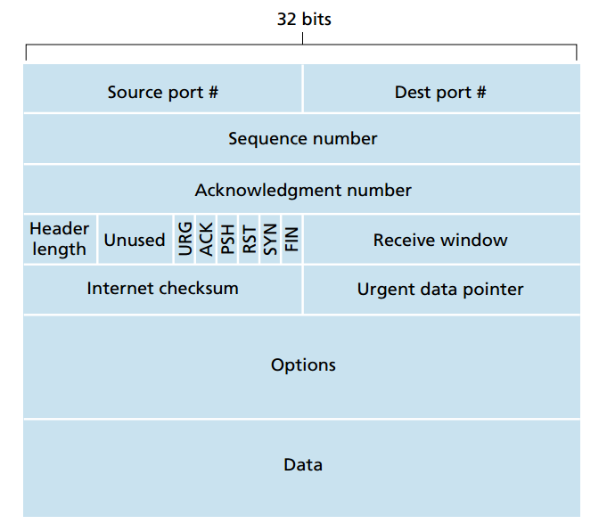
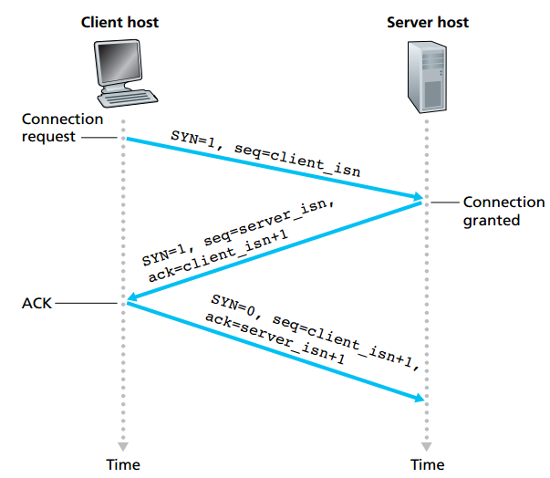
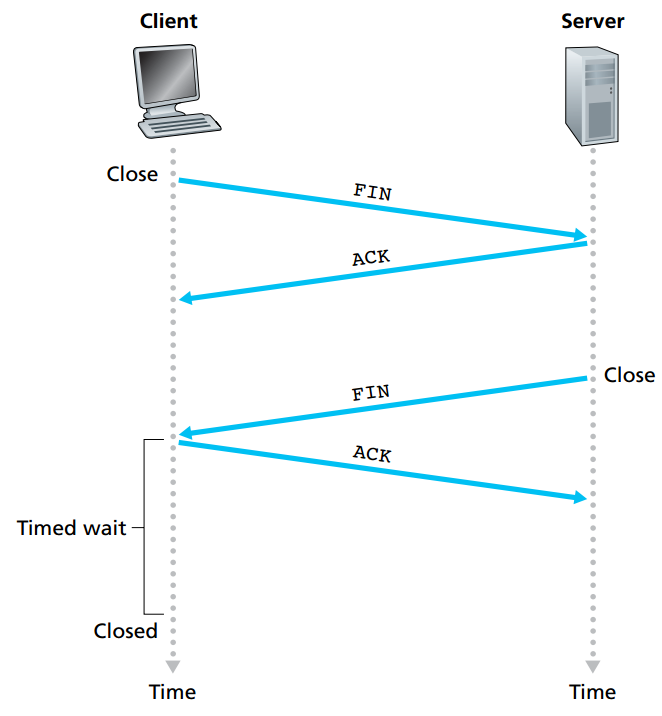

# Transport Layer
## UDP (User Datagram Protocol)
### Characteristic
#### Segment Structure
* only four fields in the header, two bytes for each

 

#### Connectionless
  
  * Use destination port number to deliever the segment to corresponding application process
  
  * No handshaking before sending a segment

### Why choose UDP over TCP
*   Finer application control
   
       * The congestion control mechanism of TCP may lead to the low transmission rate of the network if multiple links is congested.
  
       * The reliable data transfer serivce may cause the long time delivery of the packet if the segments have not been ACKed in a long time such that TCP keep re-sending the same data to the client   
  
       * What UDP will only do is that pass the segment to the network layer immediately   
   
       * For real time application, it is required a minimum sending rate and without overly delay the segment transmission.  Also it can tolerate some data loss. So UDP maybe better
  
*   No delay introduce as there is no connection establishment

*   No connection state that reduce the workload of server
  
       * TCP need to maintain different connection state includes the receive and send buffers, congestion control parameter and so on.
  
       * UDP doesn't maintain any connection states that the server can support more active clients when the application runs over UDP rather than TCP

* Small packet header overhead
  
## TCP (Transmission Control Protocol)
### Characteristic
#### Segment structure
* The header size is typically 20 Bytes 

 

#### Connection-oriented
* Handshaking before connection

* Maintain state variable for congestion control and flow control
  
* Re-transmission mechanism 
#### Others
* Full dulpex service: data can flow from A->B or B->A at the same time 
*  Point to Point: multicasting is not allowed and there must be single sender and receiver

### Three way handshake for initiate the connection
The process for TCP to initiate the connection

 

#### Explanations
1. The client send the segment: SYN **bit** = 1, seq = client_isn (randomly generated) to server, to server, to establish the connection (client: SYN_SEND, Server: LISTEN)
   
2. The server send the segment: SYN **bit** = 1, seq = server_isn (randomly generated), ack = client_isn + 1 to client, to acknowledge the segements sent from the server (Client:SYN_SEND, Server: SYN_RCVD)
   
3. The client send the segment: SYN **bit** = 0, seq = client_isn + 1, ack = server_isn + 1, to acknowledge the acknowledgment from server. (ESTABLISHED for both)

*Remarks: 
* ACK = next byte of the received data (received seq + 1)
* After the connections is established, the seq = last seq + X, where X is the number of byte/ window size

##### Why three ways handshake but not two?
* The first handshake is actaully to let the server know the client is able to send the packet, if the server can receive the packet, that means the client can send to packet 
   
* The second handshake is to let the client know the server is able to send the packet, also indicating that the server can successfully receive the packet
  
*  The third handshake is to let the server know the client can successfully receive the packet from server.

In order to let the server and client to ensure that they can both send and receive packet, the **three** ways handshake is required.

### Four ways handshake for terminate the connection
The process for TCP to terminate the connection

 

#### Explanations