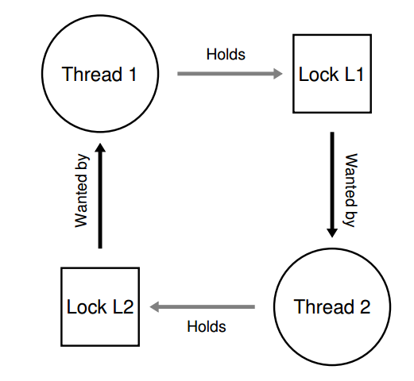
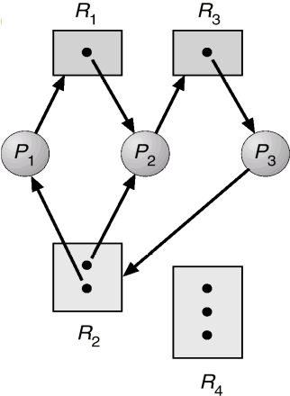

# Concurrency
## Thread

<p align="center"> 

</p>

* Advantages
  * Take less time to create/terminate a thread /do context switching than process

  * Shared memory and files 
* Disadvantages
  * No guarantee as to the order that threads will run
  
  * Difficult for programmer to acheive the synchronization of data

### Different types of thread
* User Level thread (ULT)
  * Advantages:
    * Saves the overhead of context switching as the process doesn't switch to the kernel for thread management

    * It is applicable for different OS as it is just a set of functions on application level
  
  * Disadvantages:
    * The advantage of multiprocessing cannot be taken as the kernel assigns one process to only one processor at a time and there is only one single thread within a process can execute at the time
  
    * All the threads in the process will be blocked when te system call is executed
  
* Kernel Level thread (KLT)
   * Advantages:
    * The kernel can schedule multiple threads from the same process onto multiple processor

    * The kernel can schedule another thread of the same process if one of them is blocked.
    * The kernel routine itself can be multithreaded also.
  
  * Disadvantages:
    * Managing KLT is slower than ULT
  
    * Switching from one process to another one is costly as it is required a mode switch to the kernel
    * implementations need OS support
  
* Combined Approach

  * m to n relationships (ULT -> KLT)

  * Multiple threads within the same application can run in parallel on multiple processor
  
  * A blocking system call need not block the entire process
  
  * It can take both the advantages of ULT and KLT if it is properly designed. 

## Mechanisms to ensure concurrency
### Mutual Exclusion
To solve the problem of multiple process access the same resources simultaneously
#### Implementation of Mutual Exclusion
* Hardware support (Interrupt control)

```
  void lock() {
    disable_interrupt();
  }

  void unlock() {
    enable_interrupt();
  }

  while(true) {
    lock();
    // critical section
    unlock();
  }
```
* Compare-And-Swap Instruction (Atomic instruction)
  
```
  int lock = 0;

  // swap the value if actual = expected
  int CompareAndSwap(int *ptr, int expected, int new) {
    int actual = *ptr;
    if (actual == expected)
      *ptr = new;
    return actual;
  }

  while(true) {
    // lock = 1 -> the lock is acquired, lock = 0 -> the lock is released
    while(CompareAndSwap(&lock, 0, 1)); // the thread is blocked if lock = 1
    // the critical section 
    lock = 0;
  }
```

### Semaphore
An object with an integer value that we can manipulate with two routines: sem_wait(), sem_signal(), it can be used in mutual exclusion and synchronzation
* Mutex (Binary semaphore, s.count = {0, 1})
* strong semaphore: FIFO remove from queue
* weak semaphore: unordered removal
  
```
  struct semaphore {
    int count; // 
    queue q;

    void sem_wait(semaphore s) {
      s.count--;
      if(s.count < 0) {
        q.push(p); // push the process
        block();
      }
    }

    void sem_signal(semaphore s) {
      s.count++;
      if(s.count <= 0) {
        process p = q.pop(); // pop the process
        wakeup(p);
      }
    }
  }
```

### Message passing
Provide synchronization and communication in one mechanism, with the e following APIs:
```   
send (destination, message)
receive (source, message)
```

There are 3 typs of implementations
* blocking send & receive   
Both the sender and receiver are blocked until the message is delivered

* non-blocking send & blocking receive  
sender may continue after the message is sent, the receiver is blocked until the requested message arrives

* non-blocking send and receive (no process need to wait)
  
Addressing of the message
* Direct addressing:   
The sender process send the message to the receiver directly

* Indirect addressing   
The message control is done through shared data structure (mailbox), which can decouple the sender and receiver. The sender and receiver can have the following relationship:
  * one to one (private communication)
  * one to many (boardcasting)
  * many to one (cliet-server)
  * many to many (concurrent server process with multiple client)

#### How you use message passing to acheive mutal exclusion or solving producer and consumer problem?
Mutual exclusion
```
void f(int i) {
  while(true) {
    receive (mailbox, message) // if the process need to access the critical section, it must receive a msg first
    // the critical section 
    send (mailbox, message)  
  }
}

int main() {
  create mailbox
  send(mailbox, message);
  par_run(f(0), f(1), f(2), ...)  
}

```
Producer and consumer
```
void *producer(void *arg) {
  receive (should_produce, Pmsg)
  produce();
  send(should_consume, Pmsg)
}

void *consumer(void *arg) {
  receive (should_consume, Cmsg)
  consume()
  send(should_produce, Cmsg)
}
``` 

#### Producer and Comsumer Problem
Given a fixed size of buffer, Produce produce an item and can place in the buffer. A consumer can pick items and can consume them. We have to ensure that when the producer push item onto the buffer while the consumer cannot take out the item or vice versa. 


#### Solution
```
sem_t empty = n; // # of empty space
sem_t full = 0; // # of item in the queue
sem_t mutex = 1; // binary semaphore {0, 1}, 0 is locked, 1 is unlocked 

void *producer(void *arg) {
  produce();
  sem_wait(&empty); 
  sem_wait(&mutex);
  append();
  sem_signal(&mutex);
  sem_signal(&full);
}

void *consumer(void *arg) {
  sem_wait(&full);
  sem_wait(&mutex);
  take();
  sem_signal(&mutex);
  sem_signal(&empty);
  consume();
}
```
#### Explaination
##### Producer
check whether the queue is full or not (***sem_wait(&empty)***), that is ***empty*** < 0, as empty is the number of empty space in the queue. If it is full, the producer thread will be blocked. Otherwise, the producer acquire the lock(***mutex***) in order to prevent consumer to access the buffer during appending. After that, release the lock (***mutex***) and increament the the number of item in the queue (***sem_signal(&full)***), that is full++. 
##### Consumer
check whether the queue is empty or not (***sem_wait(&full)***), that is ***full*** < 0, as full is the number of item in the queue. If it is empty, the consumer thread will be blocked. Otherwise, the consumer acquire the lock(***mutex***) in order to prevent the producer to access the buffer during comsuming. After that, release the lock (***mutex***) and increament the the number of empty space in the queue (***sem_signal(&empty)***), that is empty++. 

#### Reader and Writer Problem
Given a certain shared resources, there are some processes only perform read operation, and some of them perform write only
We have to fulfill the following requirement:
* Any number of readers may simultaneously read the file.
* Only one writer at a time may write to the file.
* If a writer is writing to the file, no reader may read it. 

#### Solution
(1)  using semaphore and lock 
```
writer() {
  semWait(y) // lock-mutex
  
  writecount++;

  if (writecount==1) 
    semWait(rsem); // block the writer
  
  semSignal(y); // unlock-mutex

  semWait(wsem); block the writer
  WRITE();
  semSignal(wsem); unblock the writer

  semWait(y); // lock-mutex
  writecount--;
  
  if (writecount==0) 
    semSignal(rsem); //  unblock the writer
  semSignal(y); // unlock-mutex
}

reader() {
  semWait (rsem); // block the reader

  semWait(x); // lock-mutex

  readcount++;
  if(readcount==1)
    semWait(wsem); // block the writer
  
  semSignal(x); // unlock-mutex

  semSignal(rsem); // unblock the reader
  READ();

  semWait(x); // lock-mutex
  readcount--;
  if (readcount==0)
    semSignal(wsem); // unblock the writer
  semSignal(x); //unlock-mutex
}
```

## Common Concurrency Problems
### Deadlock 
A set of processes/threads is blocked because each of them is holding a resource and waiting for another resource acquired by some other process

<p align="center"> 

</p>

#### Conditions for casusing deadlock 

##### Mutual exclusion (Necessary)   
No process can access a resource unit that has been allocated to another process
##### Hold and wait (Necessary)   
A process hold allocated resources while awaiting assignment of other resources
##### No preemption (Necessary)
No resource can be forcibly removed from a process holding it.
##### Circular wait (Sufficient)   
A closed chain of processes exists such that at least one resource needed by the next process in the chain 

#### Resource allocation graph

<p align="center"> 

</p>

##### How to interpret the graph
* Arrow from the resource to the process: Resource assignment to process
* Arrow from the process to resources: Resource request from process
* The dot in the resource: the number of that resource available

##### How to identify deadlock
* Observation method
  
  1. find cycle, cycle means deadlock **may** happen, but not neccessarily.
  
  2. Evalute each process, re-distribute the resources such that the process can be executed and exit, then delete that process in the graph. 
  3. If no process can be executed, it is in deadlock state. (Irreducible process)
   
* Table method
  
  1. Build the allocation table, request table, and availability table based on the graph
   
  2. Check the availability of each resources whether cause the some process to exit, if yes, reduce the row of allocation table, update the availability table
   
  3. Keep doing step 2 to reduce the process, if no process can be executed, it is in deadlock state.(Irreducible process) 