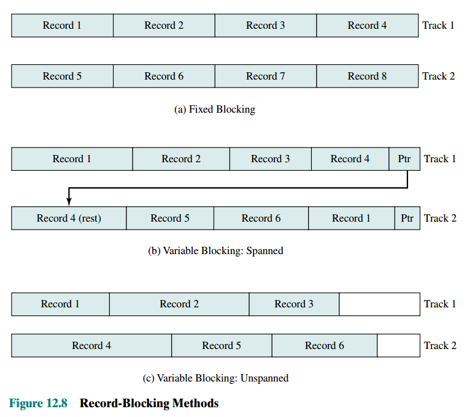
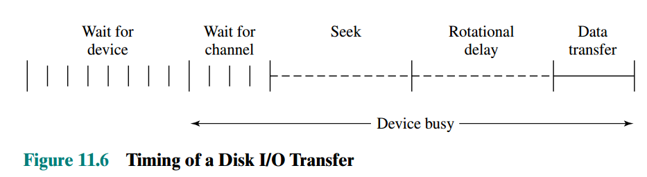
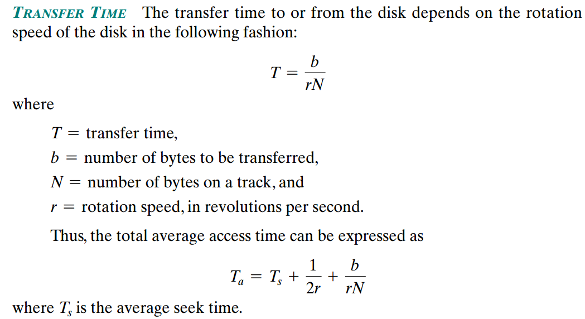
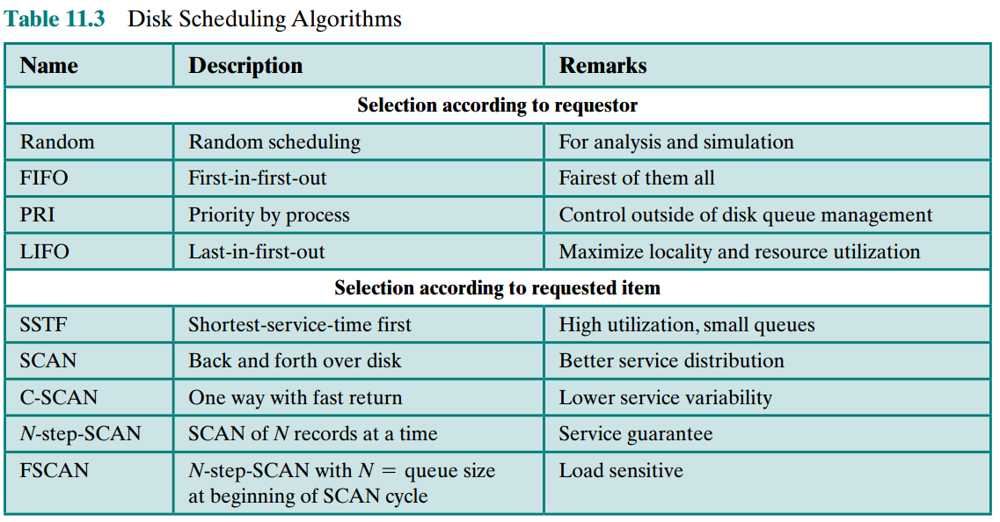
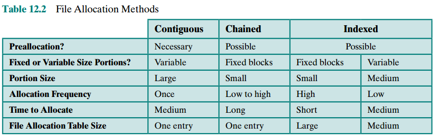
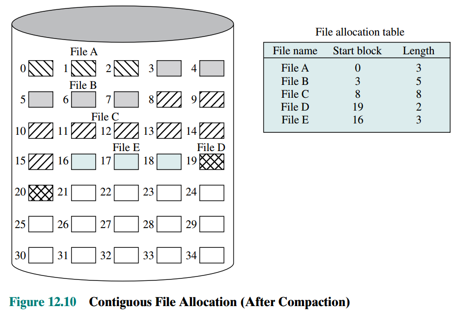
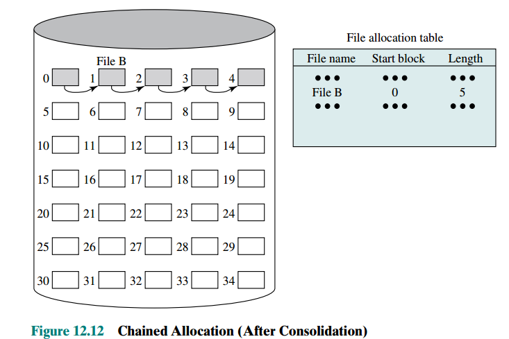
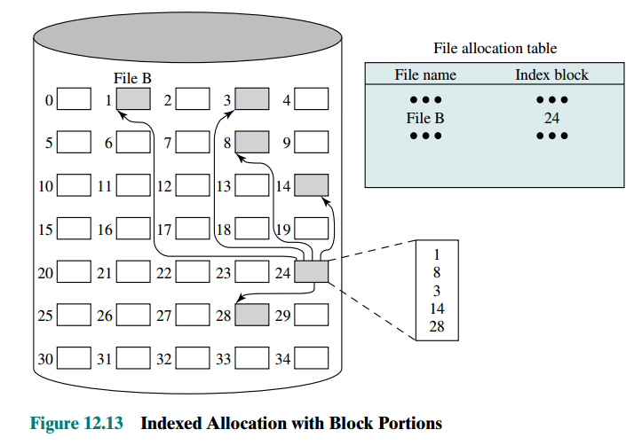
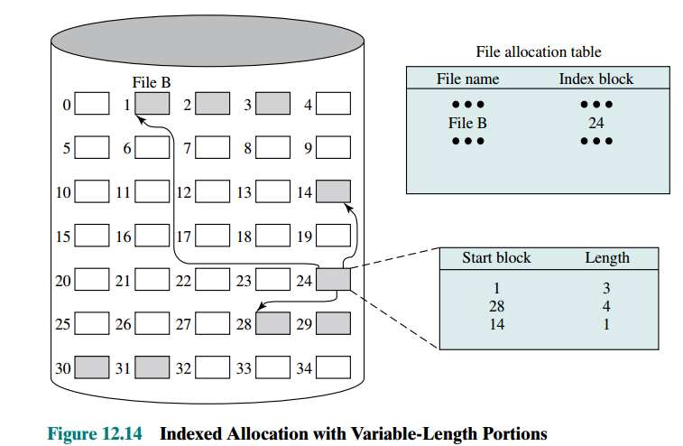

# Disk Management
## Record Blocking
How to organize record as a sequence of blocks for I/O

 

### Fixed length blocking
Fixed-length records are used, integral number of records are stored in a block

* Disadvantage
  
  * internal fragmentation due to unused space at the end of a block   

### Variable-length spanned blocking
Variable-length records are used and packed into blocks with no unused space, some record may span multiple blocks which require a pointer to the next block

* Advantages
  
  * Efficient for storage
  
  * Size of the records is not limited 

* Disadvantages
  * Difficult to implement
  
  * multiple I/O operations may be required due to the records may span mulitple blocks

### Variable-length unspanned blocking
Variable-length records are used but no spanning to other block

* Disadvantages
  
  * The space is waste because the remainder of a block may not be able to accomedate the next record if the size of the next record > remaining unused space
  
  * Size of the record is limited to the size of 

## Disk Scheduling
How to schedule individual block I/O requests for optimizing performance

### General Disk Performance Parameter

 

* Seek time
  * The time required to move the disk arm to the required track

* Rotational Delay
    * The time required for the addressed area of the disk to rotate into a position where it is accessible by the read/write head.

* Access Time
    * seek time + rotational delay

* Transfer time
    * The time required for the data transfer 

#### Timeing comparision

 

* Sequential access (adjcent track): t = time for reading 1st track + time for reading successive tracks
  * time for reading 1st track = seek time + rotational delay + time for reading all the sector in a track

  * time for reading sccessive track = N tracks * (rotational delay + time for reading all the sector in a track)

* Random access: t = N * (seek time + rotational delay + time for reading 1 sector)

* The order in which sectors are read from the disk has a tremendous effect on I/O performance

#### Operation of Disk
* To read/write, the read write head must be positioned at the desired track and at the begining of the desired sector on that track

* Once the track is selected, the disk controller waits until the appropriate sector rotates to line up with the head

* Once the head is in position, read or write operation is performed as the sector moves under the head, finally, transfer the data back

### Disk scheduling algorithm

 

 

## File Allocation
How to allocate files to free blocks on secondary storage

* OS use file allocation table to manage the file

### Allocation Policy
* Pre-allocation: Maximum size of file has to be declared at the time of file creation request

* Dynamic-allocation: Allocates space to a file in portions 

#### Trade off of portion size
  * efficency of single file vs overall system efficiency

  * larger portion: contiguity of space -> performance++
  
  * smaller portion: a large number of small portion -> size of allocation table++   
  
  * fixed size portion: simplify the re-allocation of space 
  
  * Variable-size or small fixed-size portions: minimizes waste of unused storage due to overallocation

### File allocation methods

 

 

#### Contiguous allocation

 

 

* Advantages:
  * FAT only need one table to maintain the entry of each file
  
  * I/O performance can be improved as multiple blocks can be read

  * It is easy to get back a single block (location = b + i - 1, for the file start at block b and ith block is wanted)

* Disadvantages:
  
  * External fragmentation will occur -> compaction (defragmentation) needed to perform

#### Chained allocation

 

 

* Advantages：
  
  * Any free block can be added to a chain

  * No external fragmentation

* Disadvantages:
  * To select individual block of a file requires tracing throuhg the chain (O(N) time)
  
  * No accomodation of the prinicple of localitity which has to be consolidate files periodically   

#### Indexed allocation
FAT contains an entry for a file points to the file index block 

Indexed Allocation with block portion

 

 

Indexed Allocation with variable-size portions

 

 

* Advantages：
  
  * Allocation by blocks eliminates external fragmentation

  * Allocation by variable-size portions improve locality
  
  * support both sequential and direct access to the file

* Disadvantages:
  * FIle consolidation may still need to be done to reduce the size of the index  

