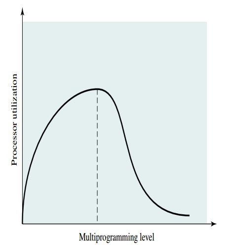

# Memory Management
The main purpose for memory management is to bring the process to the main memory. 
There are two types of memory: Main memory and virtual memory
* Main memory
  
  * Usually is RAM, the address is called physical address

* Virtual memory
  
  * Usually is a small portion of secondary storage, the address is called virtual address/logical address, relative address is the address relative to the origin of the program

## Requirements of Managment
### Relocation
* Swap the active process in and out from the main memory to maximize processor utilization by
providing a large pool of ready processes to execute

* Memory reference to program, data, function call stack need to be translate to physical address
### Protection
* The process should not able to reference memory locations in another process without permission
  
### Sharing
* Any protection mechanism must have the flexibility to allow several processes
to access the same portion of main memory

### Logical organization
* Most programs are organized into modules, some of which are unmodifiable (read only, execute only) and some of which contain data that may be modified

* The OS should have a effective way to manage the program in term of different type of modules.

* The advantages for this mechansim:
  * Modules can be written and compiled independently
  
  * Different degrees of protection can be given to different modules. 

  * Providing sharing on a module level allows the corresponding to the user’s way of viewing the problem htat it is easy for the user to specify the sharing that is desired

### Physical organization
* The flow of information should be managed by the OS but not the programmer because of the following reasons:

  * the main memory may not sufficient for the program and data, overlaying programming techniques is needed for programmer which is time-consuming and difficult

  * the programmer may not know how much space is needed and where the space will be
## Memory Management Techniques
### Fixed-size Partitioning
* Memory is divided into fixed-size section, the process with the size <>= the size of the section will be loaded into the memory

* Inefficent because of the internal fragmentation (the space in the partition is wasted as the size of process must be equal or less than the size of partition)

* Programmer need to write the program to overlay some of the portion of the partition in order to fit the size of the partition

### Dynamic Partitioning
* Each process can be loaded into the partition of exactly the same size of the process  

* Inefficent because of the external fragmentation (some of the space outside of partition can not be used such that decrease the memory utilization when time goes on)

* One of the solution of solving the external fragmentation is compaction that shift the process time to time so that there is larger contiguous space which allows new process to swap in. 

### Paging
* The main idea is to partition the memory into equal fixed-size chunks (frames), and also divide the process using the same way (pages).
  
* No external fragmentation and only consists of small portion of internal fragmentation in the last page (last part of the memoey of the process)

* The process maintain its page table that consist of the page of the process, each entry is pointing to the frame of that page

* Each logical address is calculated by the page number and offset, which is very easy for hardware to implement.

#### Address Translation
For the address n + m bits, where n bits for page number and m bits for offset
1. Extract the leftmost n bits that is the page number

2. Use the page number to find the corresponding frame number k in the process page table

3. The physical address = k * 2^m (left shift by m bits) + offset, however, the physical address need not to be calculated, as the structure must be in the ((frame number, offset)). Append the offset to the frame number will be the physical address.

#### Calculation
* Page size = frame size = 2^m
  
* Number of page = 2^n and for each page with size 2^m

#### Multi-level page table
* The main idea is to further split the portion of page number into smaller portion that to index the multiple page table instead of using the whole part of page number to index a large page table

* leftmost is the outer address
  
* increase the translation latency but reduce the memory usage  

### Segmentation
* The main idea is to partition the process into small variable-size of chunks called segments, that is not required in the same size, but there is a maximum length of the segement.

* No internal fragmentation and only consists of small portion of external fragmentation (as some of the space outside the partition may not be used, but the size of the segment can be small such that there is only a small portion of external fragmentation)

* Each process maintain its segement table， each entry provide the starting address in the memory of corresponding segment and the length of the segment to validate the address.

* Each logical address is calculated by the segment number and offset.
#### Address Translation
For the address n + m bits, where n bits for segment number and m bits for offset

1. Extract the leftmost n bits that is the segment number

2. Use the segment number to find the starting address of the segment in the memory

3. Compare the offset to the length of the segment, invalid if offset >= length

4. Physical address = starting address + offset  

## OS polices for virtual memory system
The main purpose of the policies is to reduce the page fault (the exceptions that when the requested data is not in the RAM)
### Fetch policy
Determines when a page should be brought into memory.
* Demanding Paging
  * Load the page to the memory whenever it is referenced

  * many page fault occurs when the process is started 
  
  * the rate of page fault will be dropped when time goes on due the prinicple of locality that most of the referenced page is already brought in
   
* Pre-paging
  * Load all the require page of the process into the memory at the very begining
### Placement policy
Determines where in real memory a process piece is to reside
### Replacement policy
Determines which page in memory to be replaced when a new page must be brought in
* The main idea is to the page should be removed from the memory if it has a least chance to be referenced in the future

* Complicated replacement policy introduce overhead to the system 

* Locking is introduced to ensure some of the pages will not be removed from the memory

#### Replacement algorithm
* Optimal
  * Select the page has the longest time to the next reference
  
  * **You can never do that, unless your OS can predict the future**
* First-in-first-out (FIFO)
  
  * Select the page in round robin fashion, treat the pages are in FIFO queue
* Least recently used (LRU)
  
  * the page that has not been referenced for the longest time, the performance is almost optimal because of prinicple of locality.
  
  * It is difficult to implement and introduce a great deal overhead becuase of the following reasons:
   
    * It requires some kind of mechanisims to tag the page with last reference time
  
* Clock
  * Similiar to FIFO, but introduce a bit to control the replacement
  
  * The frame in physcial memory is set when it is first loaded into the memory (use-bit = 1)
  
  * Whenever the page replacement is needed, the OS scans through all the frames and replace the frame with use-bit = 0
  
  * The implementation consists of a circular buffer of frames and a pointer points to the next frame need to be replaced
  
### Resident set management
* Determines how many pages to bring into main memory. There are two types: fixed size and variable size page size allocation

### Cleaning policy
* Determines when a modified page should be written out to secondary memory.

* Demand cleaning
  
  * A page is written out only when it has been selected for replacement
  
  * Minimize page writes but decrease processor utilization as a process that suffers a page fault may have to wait for two pages transfer before it can be unblocked
  
* Precleaning

  * Modified pages are written out before their frames are needed
  * Unnecessary cleaning operations may be performed
  
### Load control
Determines the number of processes that will be resident in main memory
* If too few processes are resident at any one time, then there will be many occasions when
all processes are blocked, and much time will be spent in swapping

* If too many processes are resident, the size of the resident set of each process will be inadequate (not enough) and frequent faulting will occur that result in thrashing. (the system spends most of its time swapping process pieces rather than executing instructions

#### Multi-programming level
The number of process vs processor utilization

 

* One of the way to control the load is to monitor the rate of the pointer scans the circular buffer of frames

  * Given two bounds, lower bound and upper bound
  
  * If the rate < lower bound, the level of muti-programming level is needed to be increased.
  * If the rate > upper bound, the level of muti-programming level is needed to be decreased.
