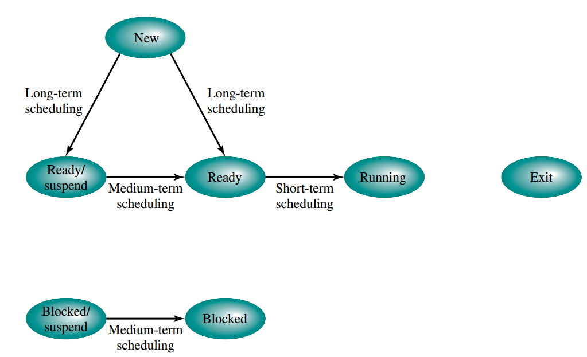

# Scheduling
The main idea of scheduling is to assign processes to be executed by the processor over time such that meets system performance requirements

## Type of scheduling

 

* Long-term
  
  * Determines whether to add a new process to the set of processes that are currently active

  * Controls the degree of multiprogramming (i.e. number of process)
* Mid-term
  
  * Part of the swapping function 

  * Determines whether to add a process to those that are at least partially in main memory and therefore available for execution

* Short-term
  
  * Determines which ready process to execute next
  
  * Another name of the short-term scheduler is called dispatcher
  
  * It is usually invoked by:
    
    * clock interrupts

    * I/O interrupts
    
    * OS system calls/traps/signals 

* I/O 
  
  * Determines which process’s pending I/O request shall be handled by an available I/O device.

## Some common system performance metric
* Turnaround time
  
  * Interval of time between the submission of the process and its completion, including **actual execution time** + **waiting time for resources**
  
  * = Exit time - Arrival time
  * = Burst time + Waiting time

* Burst time

  * the total time taken by the process for its execution on the CPU

* Response time
  
  * Interval of time between the submission of a request between the first response to that request (Arrival time to first execution time)

* Waiting time
  *  = Turnaround time - Burst time

*  Throughput
   * Number of process completed in unit time

* Processor utilization
  
  * Percentage of time of the processor is busy

* Fairness
  
  * no process should suffer starvation

## Scheduling Algorithms
* Preemptive
  
  * Currently running process may be interrupted based on certain critieria

* Non-preemptive
  
  * Once a process is in the running state, it will continue until it terminates or blocks itself by the I/O or system calls

 

where w = waiting time   

e = time spent in execution 

s = total service time required by the process, including e;

### FCFS (First come First serve)
* Use FIFO queue to implement, FIFO

### Round Robin
* Given a small slice of time, called quantum

* If the execution time of the process > quantum, the scheduler will put the current process to the tail of the queue, and start execute a new process

* If the quantum is very short, then short processes will move through the system relatively quickly, but introduce large overhead on the context switching

* If the quantum is too larger, then round robin -> FCFS

* good for time sharing system but it is unfair to I/O bounded process as they only got small portion of time compare to the processor bounded process

### SPN (Shortest Process First)
* Select the process with minimum expected processing time

* It is difficult to estimate the expected processing time correctly

### SRT (Shortest Remaining Time)
* Preemptive version of SPN

* Select the process with minimum expected remaining processing time

* If the new coming process has smaller remaining processing time than the current process, preempt it

* The difficulty are same as SPN, it may also let the longer process suffer starvation

### HPRN (Highest Response Ratio Next)
* The scheduling process based on the following formula:
  
  * R = (w + s)/s
  * where R is response ratio, w is time spent waiting for the processor,s is the expected service time 

* Select the process with maximum value of R

### Feedback Queue
* The multiple priority queue scheduling is problematic that the low priority process may suffer from starvation if the high priority process requires long execution time

* Each time when the process is preempted, it is moved to the lower level queue and wait for execution

* It can also promote the low priority process to higher level queue if the waiting time reach certain value 

### Fair-share scheduling
* Each user is assigned a weighting of some sort that defines that user’s share of system resources as a fraction of the total usage of those resource

* To give fewer resources to users who have had more than their fair share 

* To give more to those who have had less than their fair share