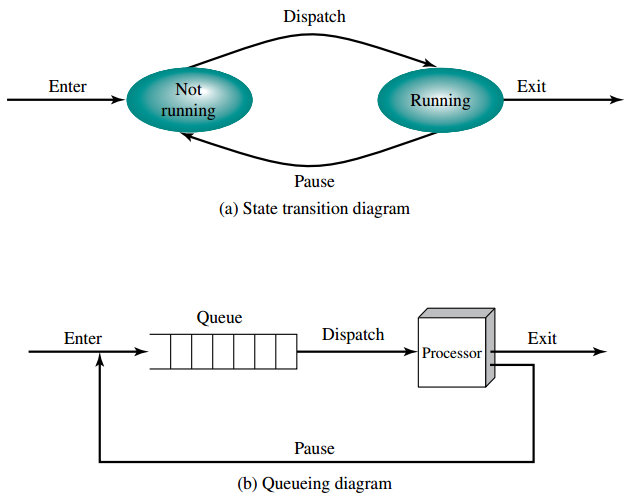
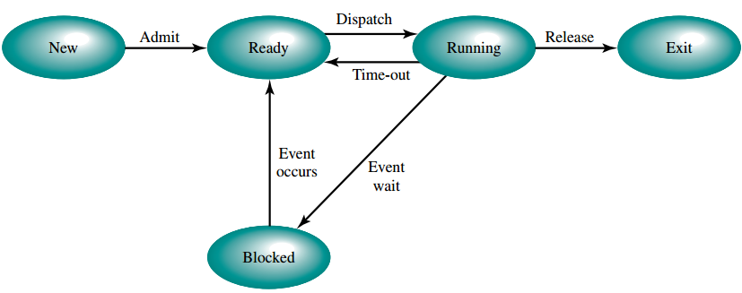
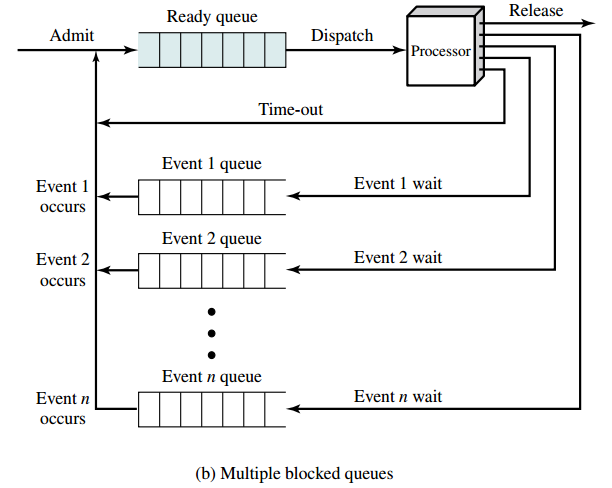
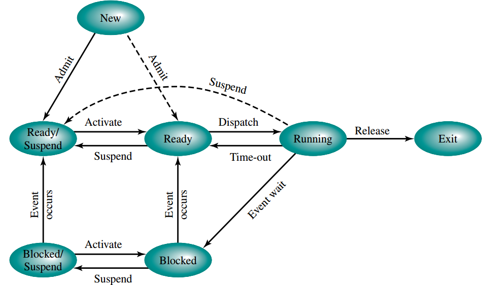

# Virtualization

## OS Control Structure
* File Table
  * Existence of files
  * Location on secondary memory
  * Current status 
* I/O Table
  * The status of I/O operation
  * The location in the main memeory for I/O data transfer
* Memory Table
  * Track both main/secondary memory:
    * The allocation of the main/secondary memory to process
    * Information needed to manage the virtual memory
    * Protection attributes of blocks of memory
## System Protection   
The system mode can be divided into two mode: User Mode, kernel Mode.
The application program is executed in user mode while the OS component is executed in kernel mode.The execution mode switching is done by system call/interrupt. The main objective is that we don't want to the user to control the system resource directly.
* CPU Protection
  * The user program can't hold the CPU forever
  
  * Solution
    * using timer interrupt to acheive CPU time sharing
* Memory Protection
  
  * The user program can't use arbitrary amount of memory/access data belonging to the other program
  
  * Solution
    * Use base register(smallest legal address) and limit register(size of the adderss range) to determine the range of legal address

    * Access the address outside the defined range leads to a trap in kernel (exeception) 
  
* I/O Protection
  * The user program are not allowed to directly access the I/O devices. For example I/O instruction/ controller register can only be used/accessed in kernel mode by system calls

## Type of System Call
* Process control
* FIle management
* Device management
* Information maintenance
* Communications

## Process
process is a running program, the each process is independent to each other 
### Process component
* Program code

* Data

* Process control block
  * Process identification
    * PID (unique numeric to identify the process)
  * Process state information
  
    * User-visible registers
    * COntrol and status registers
      * Program counter: contains the address of the next instruction
      * Condition codes: sign, zero, carry, equal,...
      * Status information: interrupt enabled/disable flag, execution mode
    * Stack pointer

  * Process control information
    * Process state
    * Priority
    * Scheduling-related info
    * Waiting event
### Scheduling component
* Scheduler
  * To select the jobs to be submitted into the system and decide which process to run based on certain policies
* Dispatcher
  * context switching
  * execution mode switching (user <--> kernel)
### State model (Assume only one processor)
#### Two-state model 

 

##### Explanations
In this model, a process can only in one of the two states: Running or Not Running.
When the OS creates a new process, it will be pushed into the queue that is in the **Not Running** state. From time to time, the dispatcher will select the process in the queue to execute that transfer the process state from **Not Running** to **Running**. When the current process is interrupted, the OS will push back the current process to the queue and dequeue the next process for execution

* Disadavantages  
  Consider the following case: Some prcoess is ready to execute and some of them is blocked by the I/O, the only way to solve this problem is the traversal the queue and pick out the one is ready, which is super inefficient 

#### Five-state model

 

##### Explanations
* New  
  * A process that has just been created but has not yet been admitted to the pool of executable processes by the OS. 
* Ready
  * A process that is prepared to execute
* Blocking
  * A process that cannot execute until some event occurs.
* Running
  * The process that is currently being executed
* Exit  
  * A process that has been released from the pool of executable processes by the OS

 

To solve the problem of two-state model that is the CPU has to scan through the queue to pick out the suitable process to execute, we assign different queue for different event, so for all process in that event queue, they are in the same state, and the CPU just need to pop it out when the event occurs

* Disadavantages   
  As each process to be executed must be loaded fully into main memory, and I/O is much slower than computation, it is very common that all process in the memory is blocked therefore the CPU is idle, the use of memory is not efficient also.

#### Five-state model with suspend states

 

##### Explanations
With this design, we can move all the blocked process into the disk by swapping, and take it out when the event occurs

##### Reasons for process suspension
* Swapping  
    Moving part or all of a process from main memory to the disk in order to release sufficient main memory to bring in a new process

* User request
* Timing 
  * The process may be executed periodically
* Parent process request
* Others
  OS suspects process of causing the problem

### Life Cycle of a process
* Creation
  1. Assign PID to the process and add new entry in process table
  2. Allocates space for the process
  3. Initialize process control block
  4. setup appropriate linkages (push it to the ready queue)
  5. Create or expands other data structures (accounting file for performane assessment)
* Switching
  1. Save the context of the processor (PC, other regs)
  2. Update PCB in the running state
  3. Move the PCB to appropriate queue based on the event
  4. Select another process for execution
  5. Update the PCB of the selected process
  6. Update the memory-management data structure (Virtual memory/paging)
  7. Restore the context when the selected process switched out  
  * Reason of process switching (context switching)
    * Interrupt (asynchronous request from outside)
    * Trap (error or exception occur)
    * Supervisor call (system call)
* Termination
  1. Remove PCB
  2. Free the system resources
  3. return the termination status to the parent if the parent process is waiting for the child process to terminate